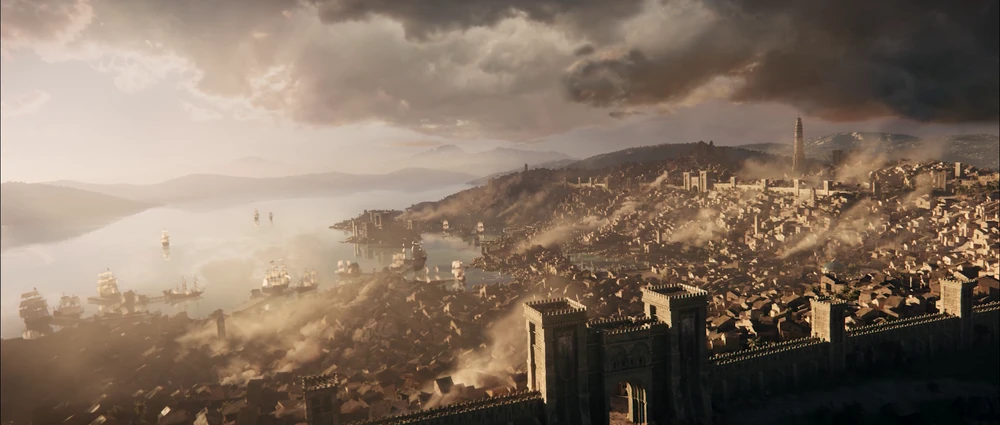
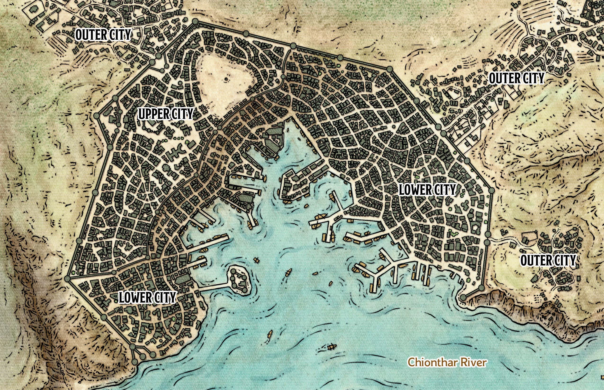

- Es una de las metrópolis y es de las ciudades-estado más grandes de la [[Sword Coast]], dentro de las Grandes Tierras del Oeste. Es una ciudad abarrotada de comercio y oportunidades, y una de las ciudades mercantiles más prósperas e influyentes de la costa occidental de [[Faerûn]]. A pesar de su larga presencia como potencia neutral, los líderes de [[Baldur's Gate]] son miembros de la Alianza de los [[Señores en el Oeste]].
- La fuerte fuerza de mantenimiento de la paz conocida como [[The Watch]], junto con la presencia de la poderosa compañía mercenaria de los [[Flaming Fist]], mantuvo la ciudad en general pacífica y segura. Esta sensación inherente de seguridad permitió a la [Puerta]([[Baldur's Gate]]) mantener una actitud tolerante y acogedora hacia los forasteros, ya fueran comerciantes ricos, refugiados pobres o, como históricamente atrajo, individuos menos escrupulosos como piratas y contrabandistas.
- 
- ---
- ### Historia
	- Baldur's Gate comenzó como una ciudad portuaria donde los comerciantes se encontraban con "encendedores fantasma", gente a lo largo de la Sword Coast que usaba luces para atraer a los barcos atrapados por la niebla a la costa. Cuando esos barcos encallaban, los encendedores fantasma recogían los restos del naufragio y transportaban sus bienes saqueados a [[Baldur's Gate]], ubicado en la orilla norte de un recodo del río [[Chionthar]], y vendían su botín. En los años transcurridos desde entonces, [[Baldur's Gate]] se ha convertido en una ciudad amurallada. Hoy en día, sus calles brumosas se tiñen de rojo con la sangre de los desafortunados que caen presa de malvados oportunistas, muchos de los cuales se consideran nobles, comerciantes, piratas y asesinos. Un ejército de soldados mercenarios llamados “ [[Flaming Fist]] ” mantiene el orden en la ciudad, y estos soldados responden al Gran Duque [[Ulder Ravengard]]. A los miembros del [Puño Flamígero]([[Flaming Fist]]) no les importa la justicia; Anhelan el poder y la moneda, nada más. Pero a pesar de la reputación de crueldad del [Puño]([[Flaming Fist]]), el Gran Duque es ampliamente considerado como un hombre honorable y razonable.
	- Si bien el nombre de la ciudad no solía ser [[Baldur's Gate]] este se fue quedando poco a poco gracias a los comerciantes que desembarcaban en el muelle y tenían que pasar sus bienes por la puerta de este nombre construida por el gran [[Balduran]].
- ---
- ### Ubicaciones Notables
	- [[Baldur's Gate]] estaba dividida en tres secciones principales, como se muestra en el mapa. La Ciudad Alta era la región amurallada al norte. La Ciudad Baja era la parte entre la Muralla Vieja y el río [[Chionthar]]. La Ciudad Exterior era el barrio de chabolas que se levantaba a lo largo de los caminos hacia la ciudad y alrededor de [[Dusthawk Hill]].
	- 
	- #### Upper City
	  id:: 68632a7c-cfc7-4f8a-b8fc-b383a67e5b3d
		- La Ciudad Alta de [[Baldur's Gate]], irradiaba riqueza y belleza, sirviendo como hogar a la clase patrial de la ciudad. Tenía calles anchas y bien iluminadas y atractivos edificios decorados con plantas colgantes. La amenidad de la Ciudad Alta solo era igualada por su bien cuidada seguridad, en gran parte gracias a las patrullas regulares mantenidas por la Guardia.
	- #### Lower City
	  id:: 68632a7c-e496-495f-8da6-96ad7d1ae0f8
		- La Ciudad Baja era la gran porción en forma de media luna de [[Baldur's Gate]] completamente contenida dentro de las murallas. Presentaba calles apretadas, bordeadas de edificios altos y esbeltos. incluso callejones más estrechos que siempre estaban ocupados con las idas y venidas de la vida de la ciudad. El comercio y el trabajo de todo tipo dominaban esta extensa parte de la ciudad.
	- #### Outer City
		- La Ciudad Exterior de [[Baldur's Gate]] era un extenso y caótico barrio de chabolas que crecía fuera de las murallas de la ciudad. El día y la noche se mezclaban en los cobertizos, corrales y otras chozas y se alineaban en las calles embarradas de la Ciudad Exterior. Mientras que los cuidadores de animales, los comerciantes-vendedores ambulantes y otros "forasteros" eran gravados y técnicamente "gobernados" por los Grandes Duques, los funcionarios de la ciudad hicieron poco para gobernar realmente la Ciudad Exterior no regulada.
	- #### Subterraneo
		- Debajo de las calles de la ciudad había un extenso salón de fiestas subterráneo conocido como el sótano. Sótanos húmedos, pasillos sinuosos y túneles estrechos componían su extensa red que se extendía por debajo de casi todos los rincones de la región de la [Ciudad Alta](((68632a7c-cfc7-4f8a-b8fc-b383a67e5b3d))). Las entradas a este dominio secreto eran numerosas, pero bien controladas, ya fuera por empresas privadas, mercantiles o criminales.
	- #### Wyrm's Crossing
		- El Cruce del Wyrm era el gran puente doble que cruzaba el río [[Chionthar]], que se extendía de norte a sur desde la isla-fortaleza de la Roca del Wyrm. En la parte superior del cruce se construyeron una miríada de edificios diferentes: desde elaboradas tiendas mercantiles de varios pisos hasta pequeños puestos de vendedores e incluso negocios precarios que colgaban del lado del puente de piedra, con vistas a las aguas del [[Chionthar]].
		- El puente se alzaba sobre enormes arcos que dejaban un amplio espacio para que el tráfico marítimo pasara sin obstáculos. Era lo suficientemente ancha como para permitir que los viajeros por tierra pasaran a través de sus numerosos edificios, a lo largo de la carretera que conducía a [[Baldur's Gate]] propiamente dicha.