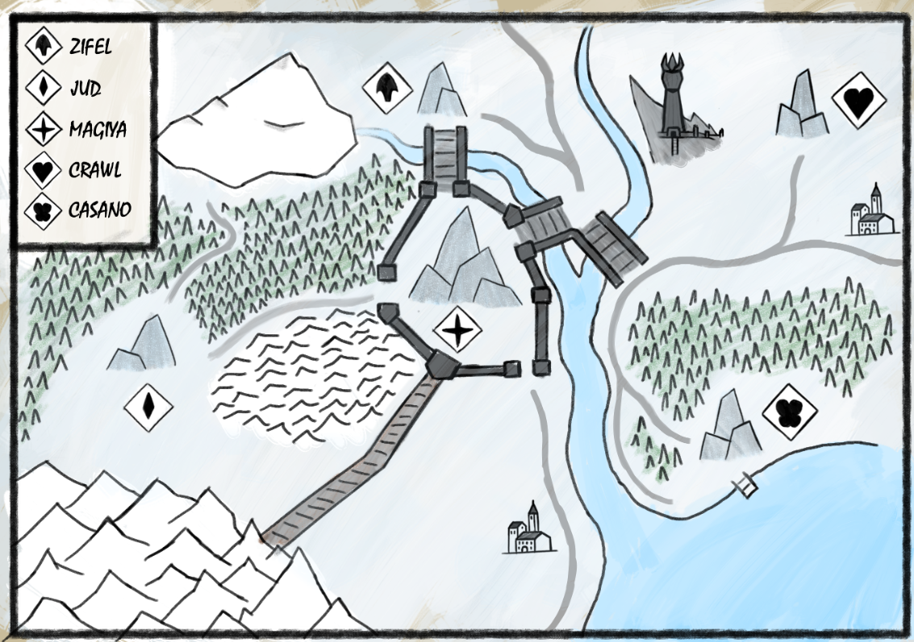

- La región de el alto hielo abarca cientos de kilometros en las vastas nieves del norte. En algun momento Icewind Dale formo parte de el hasta que este se independizo, pero los gobernantes de Everfrost jamas admitieron esta independencia.
- {:height 557, :width 780}
- ---
- # Información General
	- La region es controlada por 5 familias cada una encargandose de una zona: Los Jud al Oeste, los Zifel al Norte, los Cassanova al Sur, los Crawl al Este y los Magiyas la ciudad de Everfrost.
	- La magia es muy importante para los habitantes, por ese motivo cada vez que un miembro de las 5 casas de Everfrost esta por cumplir la mayoria de edad (en años elficos) debe realizar una caseria de algun tipo de magia, esto puede ser un objeto, un hechizo, conocimiento, o una criatura incluso. La familia con el mayor tributo tiene reclamo sobre el control de Everfrost, y con el, influencia sobre toda la region.
- ---
- ## Lugares
- ### Shalai
	- Pequeña ciudad al Oeste de [[Everfrost]]. Controlada por los [[Jud]].
- ### Coretali
	- Ciudad con tintes italianos al Sur de [[Everfrost]]. Controlada por los [[Casano]].
- ### Voromir
	- Ciudad al Este de [[Everfrost]]. Controlada por los [[Crawl]]. Propietarios de [[Revel's End]], una prisión de maxima seguridad.
- ### Ryleh
	- Ciudad al Norte de [[Everfrost]]. Controlada por los [[Zifel]]. Posee una de las bibliotecas mas grandes de [[Faerûn]], incluso después de la revolución.
- ### Everfrost
	- La ciudad de [[Everfrost]], el corazón de la region. Controlada por los [[Magiya]].
- ### Monte Horu
	- Una gran montaña al noroeste. No sera la montaña mas alta pero las vistas son increíbles.
- ### Dominio de Baur
	- Una gran cordillera de montañas al suroeste. A pesar de las arduas condiciones algunas tribus y monasterios se han asentado aquí.
- ### Revel's End
	- Una prisión de maxima seguridad. Su ubicación y el clima hacen que si alguien llegara a escapar seria atrapado rápidamente o moriría intentando regresar a la civilización.
- ---
- ## Mitologia
  Una vieja canción de cuna, conocida mas que nada por ancianas de pequeños pueblos al norte, dice que la región solía ser una sola gran montaña llamada *Everest* hasta que el héroe fundador [[Frost]] partió la montaña en tres con [su espada]([[Winter's Bite]]) y fundó la ciudad de [[Everfrost]] donde esta quedo incrustada.